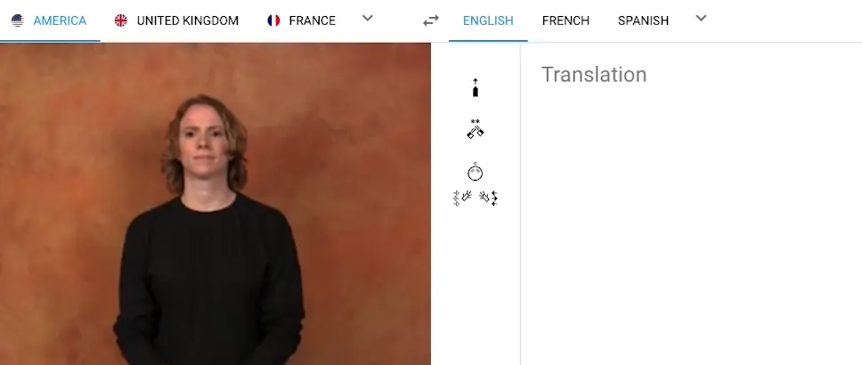

🧠 SENSI (Sign-Enabled Network for Student Inclusion)

An AI-powered accessibility agent that translates academic content into real-time sign language.

SENSI is an autonomous, AI-driven accessibility bridge built for prelingual Deaf students. Instead of forcing students to adapt to inaccessible systems, SENSI acts as an intelligent sidecar—converting complex text and speech into real-time American Sign Language (ASL) stickman animations.

🚧 The Problem: The "Silent Wall" in Higher Education

Prelingual Deaf students face a deeper challenge than just “hearing loss”—it’s a language barrier embedded in education systems.

🔹 The Literacy Gap

Sign Language is often the first language (L1)

Written English is a second language (L2) with completely different structure

Reading dense academic material ≈ learning in a foreign language

🔹 The Visibility Problem

Critical updates (CATs, exams, deadlines) are hidden in:

Long emails

LMS sub-menus

Students often discover them too late

🔹 Interpreter Scarcity

Severe shortage of STEM-specialized interpreters

No real-time support in technical lectures

Leads to measurable academic disadvantage

🔹 Cognitive Overload

Switching between:

Notes

Dictionaries

Videos

Causes mental fatigue, reducing actual learning capacity

💡 Our Solution: Autonomous Translation Agent

SENSI removes friction by shifting the burden of translation from the student → to AI.

⚡ Core Capability

Converts:

📄 Text (PDFs, notes, LMS content)

🎤 Speech (lectures)

Into:

✋ Real-time ASL stickman animations

🎯 Why Stickman Animation?

Instead of heavy 3D avatars, SENSI uses lightweight stickman-based signing:

1. 📶 Low-Bandwidth Friendly

Works on limited data bundles

No dependency on high-speed internet

2. 👁️ Focus Over Realism

Avoids uncanny valley issues

Emphasizes:

Hand shapes

Motion clarity

Sign precision

3. ⚡ Zero-Latency Experience

Instant rendering

No lag during:

Live lectures

Real-time reading

🚀 Key Features
📄 PDF Overlay Assistant

Highlight any text → instantly translated to ASL

Works like a live interpreter inside documents

🎥 Live Lecture Bridge (Planned)

Real-time translation of:

Lecturer speech

Gestures

📚 Gloss Library

Community-driven sign dictionary for:

Technical terms (e.g., Backpropagation, Constitutional Law)

Solves the STEM vocabulary gap

🤖 Autonomous Agent Behavior

Detects important academic content

Proactively surfaces:

Deadlines

Announcements

Updates

🧱 Tech Stack

Frontend: TypeScript, HTML, SCSS

Core Logic: JavaScript

Backend / Services: Ruby (supporting services or scripts)

Documentation / Academic Content: TeX

Other Tools: Miscellaneous supporting utilities

AI Layer: NLP + Speech-to-Text + Sign Mapping

Rendering Engine: Lightweight vector-based animation

Agent System: Event-driven + context-aware triggers

🎨 Design Philosophy

🔴 Vibrant Red Accents → draw attention to critical info

⚪ Pure White Base → clean and distraction-free

⚫ Charcoal Text → reduces eye strain

🧩 Minimal UI → content-first experience

🌍 Social Impact

SENSI is built to close the Comprehension Gap in education.

By automating accessibility:

Students spend less time decoding

More time actually learning

The goal: return 100% cognitive energy back to the student.

🛠️ Future Roadmap

Browser Extension (LMS integration)

Mobile App version

Offline mode for low-connectivity regions

Multi-sign language support (beyond ASL)

AI-powered personalized learning assistant

🤝 Contributing

We welcome contributions in:

Accessibility research

Sign language datasets

AI/NLP improvements

Frontend UX

📌 Project Context

Built for the 2026 AI Solutions Hackathon.

🧭 Vision

“Accessibility should not be a feature. It should be the default.”

SENSI is not just a tool—it's a step toward inclusive education systems where no student is left behind.<<<<<<< HEAD

<h1 align="center">👋 Sign Translate</h1>

<p align="center">
  <i>
    Revolutionizing Sign Language Communication with Cutting-Edge Real-Time Translation Models.
    <br>
    Enjoy seamless Sign Language Translation on desktop and mobile.
  </i>
</p>

<p align="center">
  <a href="https://sign.mt/"><strong>sign.mt</strong></a>
  <br>
</p>

<p align="center">
  <a href="https://github.com/sign/.github/blob/main/CONTRIBUTING.md">Contribution Guidelines</a>
  ·
  <a href="https://github.com/sign/translate/issues">Submit an Issue</a>
</p>

<p align="center">
  <a href="https://github.com/sign/translate/actions/workflows/client.yml">
    
  </a>
  <a href="https://github.com/sign/translate/actions/workflows/server.yml">
    
  </a>
  <a href="https://coveralls.io/github/sign/translate?branch=master">
    
  </a>
  <a href="https://github.com/sign/translate/blob/master/LICENSE.md">
    
  </a>
</p>

<p align="center">
  <a href="https://github.com/sign/translate/stargazers" target="_blank">
    
  </a>
  <a href="https://github.com/sign/translate/network/members" target="_blank">
    
  </a>
  <a href="https://github.com/sign/translate/stargazers" target="_blank">
    
  </a>
  <a href="https://github.com/sign/translate/issues" target="_blank">
    
  </a>
</p>

<p align="center">
  <a href="https://sign.mt" target="_blank">
    
  </a>
</p>

<hr>

## Key Features

### [Sign Language Production](https://github.com/sign/translate/wiki/Spoken-to-Signed)

```
┌─────────────────────┐
│Spoken Language Audio│                                                              ┌─────────┐
└─────────┬───────────┘                                                  ┌──────────►│Human GAN│
          │                                                              │           └─────────┘
          ▼                                                              │
┌────────────────────┐     ┌───────────────┐     ┌───────────┐    ┌──────┴──────┐    ┌───────────────┐
│Spoken Language Text├────►│Normalized Text├────►│SignWriting├───►│Pose Sequence├───►│Skeleton Viewer│
└─────────┬──────────┘     └───────────────┘     └───────────┘    └──────┬──────┘    └───────────────┘
          │                        ▲                   ▲                 │
          ▼                        │                   │                 │           ┌─────────┐
┌───────────────────────┐          │                   │                 └──────────►│3D Avatar│
│Language Identification├──────────┘───────────────────┘                             └─────────┘
└───────────────────────┘
```

### [Sign Language Translation](https://github.com/sign/translate/wiki/Signed-to-Spoken)

```
┌──────────────────────────┐                                ┌────────────────────┐
│Upload Sign Language Video│                      ┌────────►│Spoken Language Text│
└──────────┬───────────────┘                      │         └──────────┬─────────┘
           │                                      │                    │
           │          ┌────────────┐       ┌──────┴────┐               │
           ├─────────►│Segmentation├──────►│SignWriting│               │
           │          └────────────┘       └───────────┘               │
           │                                                           ▼
┌──────────┴────────────────┐                               ┌─────────────────────┐
│Camera Sign Language Video │                               │Spoken Language Audio│
└───────────────────────────┘                               └─────────────────────┘
```

### Want to Help?

Join us on the journey to revolutionize sign language communication.
Follow our progress on the [Project Board][project-board],
shape the project's future,
and delve deeper into our vision and plans in the [Wiki][wiki].

Wish to report a bug, contribute some code, or enhance documentation? Fantastic!
Check our guidelines for [contributing][contributing] and then explore our issues marked as <kbd>[help wanted](https://github.com/sign/translate/labels/help%20wanted)</kbd> or <kbd>[good first issue](https://github.com/sign/translate/labels/good%20first%20issue)</kbd>.

**Find this useful? Give our repo a star :star: :arrow_up:.**

[](https://github.com/sign/translate/stargazers)

[wiki]: https://github.com/sign/translate/wiki/Spoken-to-Signed
[contributing]: https://github.com/sign/.github/blob/main/CONTRIBUTING.md
[project-board]: https://github.com/sign/translate/projects/1

## Development

### Prerequisites

- Install [Node.js] which includes [Node Package Manager][npm]

### Setting Up the Project

Install dependencies locally:

```bash
npm install
```

Run the application:

```bash
npm start
```

Test the application:

```bash
npm test
```

Run the application on iOS:

```bash
npm run build:full && \
npx cap sync ios && \
npx cap run ios
```

[node.js]: https://nodejs.org/
[npm]: https://www.npmjs.com/get-npm

### Cite

```bibtex
@misc{moryossef2023signmt,
    title={sign.mt: Effortless Real-Time Sign Language Translation},
    author={Moryossef, Amit},
    howpublished={\url{https://sign.mt/}},
    year={2023}
}
```

=======

# SENSI — Assistive Wearable Technology

**SENSI** is an innovative, wearable assistive device designed to support individuals with visual and/or hearing impairments. The MVP (Minimum Viable Product) focuses on real-time environmental awareness through haptic feedback, helping users navigate and respond to their surroundings safely and independently.

---

## Project Status: MVP (Minimum Viable Product)

This is the first working prototype of SENSI, showcasing core functionalities including:

- Obstacle detection via ultrasonic sensors
- Haptic feedback for proximity alerts
- Basic sound detection and classification (e.g., horns, alarms)
- Bluetooth integration with mobile navigation apps (basic alerts)

---

## Core Features

| Feature                  | Description                                                                  |
| :----------------------- | :--------------------------------------------------------------------------- |
| Sound Detection          | Recognizes critical sounds (horns, sirens) and alerts the user via vibration |
| Obstacle Detection       | Ultrasonic sensors detect nearby objects and trigger warning vibrations      |
| Mobile Integration       | Pairs with smartphone GPS for directional feedback                           |
| Custom Feedback Patterns | Vibrations vary by alert type to allow non-verbal recognition                |
| Power Efficient          | Optimized for low-power operation with rechargeable battery                  |

---

## Tech Stack

- **Hardware**: Arduino Nano / ESP32, Ultrasonic sensor (HC-SR04), Microphone module, Vibration motor, Bluetooth module (e.g., HC-05), Rechargeable Li-Po battery
- **Software**:
  - Arduino IDE (C++)
  - Optional: Android companion app (Kotlin/Java)
  - Sound classification via basic FFT (Fast Fourier Transform)

---

## 💻 My Contribution

- Designed and assembled the wearable hardware prototype, integrating ultrasonic sensors, microphone, and haptic feedback motors.
- Developed the microcontroller firmware in Arduino IDE (C++) for real-time obstacle and sound detection.
- Implemented custom vibration patterns for distinct alert types to enhance user recognition.
- Conducted initial testing and identified key limitations for future optimization.

---

## Installation & Setup (MVP)

1.  **Clone the repository:**
    ```bash
    git clone [https://github.com/yourusername/sensi.git](https://github.com/yourusername/sensi.git)
    cd sensi
    ```
2.  **Upload firmware to microcontroller via Arduino IDE:**
    - Select the correct board & port in Arduino IDE.
    - Flash the `sensi_mvp.ino` file to your microcontroller.
3.  **Pair device with mobile app via Bluetooth** (if applicable): Follow instructions in the companion app.
4.  **Power on and test:**
    - Bring your hand near an obstacle to test proximity feedback.
    - Simulate a loud sound (e.g., clap) to test sound detection feedback.

---

### Testing & Limitations

- **Obstacle Detection Range:** Current prototype range is approximately 1.5 meters.
- **Sound Classification:** Limited to a small, predefined set of sounds within the MVP scope.
- **Battery Life:** Approximately 6 hours of continuous use (further optimization planned).

---

## Roadmap

- Expand sound classification capabilities using AI/ML (Edge computing).
- Refine haptic "language" for more nuanced and complex alerts.
- Develop a native Android/iOS companion app with advanced features, including GPS voice-to-vibration translation.
- Improve wearable comfort and implement a waterproof casing.

---

## Contributing

Contributions, bug reports, and feedback are welcome!

1.  Fork the repository.
2.  Create a new branch (`git checkout -b feature-x`).
3.  Commit your changes (`git commit -am 'Add new feature'`).
4.  Push to the branch (`git push origin feature-x`).
5.  Create a Pull Request.

---

## License

This project is licensed under the MIT License - see the `LICENSE` file for details.

---

## Acknowledgements

- Assistive tech pioneers for their inspiring work.
- Open-source communities supporting accessibility innovation.
- Users and testers who provided invaluable feedback during MVP development.
  > > > > > > > 3fecb83ec50ca2cbf9a7a2adcac8b9d1dadf1da3
